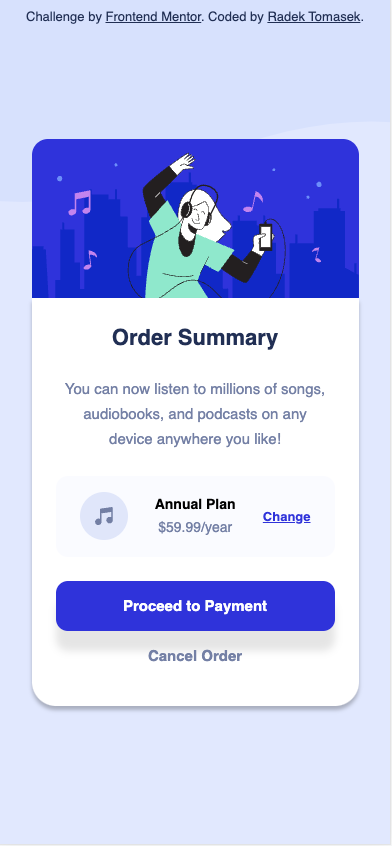
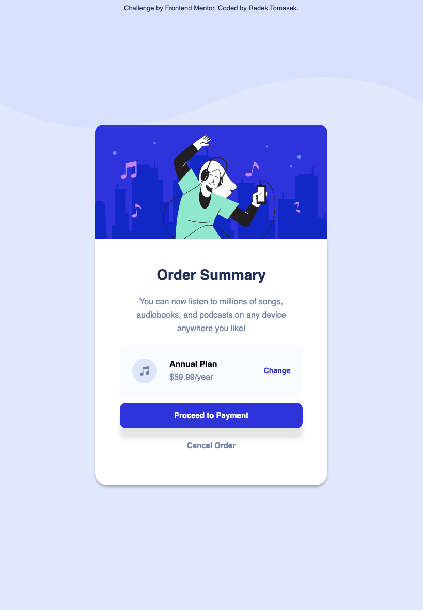
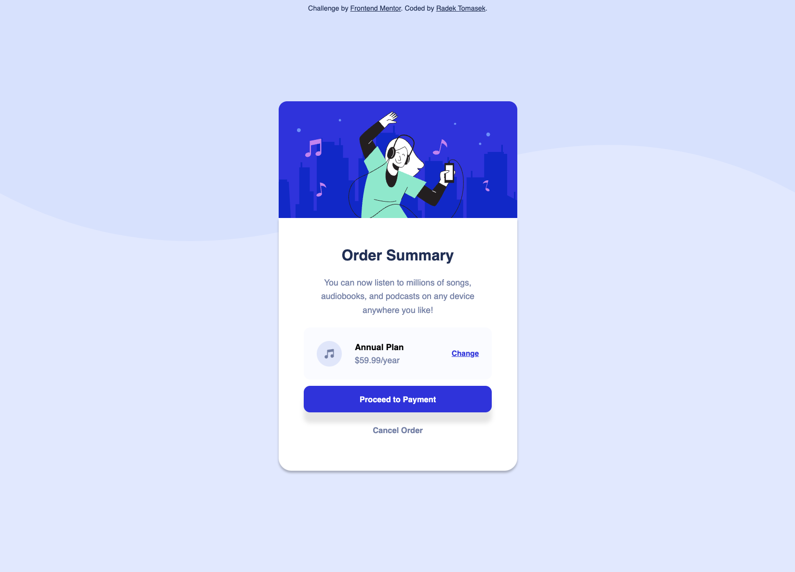

# Order summary component

This repository contains an implementation of one of the Frontend Mentor Challenges - [Order summary component](https://www.frontendmentor.io/challenges/order-summary-component-QlPmajDUj) using HTML/CSS ([TailwindCSS](https://tailwindcss.com)).

## Overview

### The Challenge

This challenge ([Order summary component](https://www.frontendmentor.io/challenges/order-summary-component-QlPmajDUj)) was the fourth one I picked from the [Frontend Mentor](https://www.frontendmentor.io).

As an experienced frontend developer (including tons of HTML/CSS), I deliberately choose the simplest ones for my initial submitions to make sure I get comfortable with the process and tooling. I use ([TailwindCSS](https://tailwindcss.com)) and utilize the simplicity of each layout to apply as many best practices as practices, whilst still learning new things.

And in this solution, I was able to dig deeper into reusability area.

Let me summarize the solution in next few sections.

### Screenshots

There are a few screenshots captured within the various screen sizes.

#### Mobile Version

This is the **mobile version** as displayed on **iPhone 12 Pro**.



#### Tablet Version

This is the **tablet version** as displayed on **iPad Air**.



#### Desktop Version

This is the **desktop version** as displayed on a large screen.



### Links

- Solution URL: [https://github.com/radektomasek/fm-order-summary-component](https://github.com/radektomasek/fm-order-summary-component)
- Live Site URL: [https://radektomasek.github.io/order-summary-component](https://radektomasek.github.io/order-summary-component)

## My process

Building [this challenge](https://www.frontendmentor.io/challenges/order-summary-component-QlPmajDUj) was another fun process. My focus was to keep the code as clean and reusable as possible. This brought a usage of CSS variable with combination of the extensibiliy of the Tailwind settings. And I am really grateful for the output as it gives me enough exposure to apply similar patterns in other projects too.

### Built with

- Semantic HTML5 markup
- Mobile-first workflow
- [Parcel](https://parceljs.org) - a simple, zero config builder
- [TailwindCSS](https://tailwindcss.com) - TailwindCSS for styles

### What I learned

I learned a lot about various Tailwind configuration options and how to combine them with the CSS variables. In particular, I like how things like font-sizes could be extended:

```js
// tailwind.config.js

// the variables are defined in the style,
// e.g: --text-size-small: 0.9375rem; /* 15px */

fontSize: {
'2xs': ['var(--link-size-small)', {
    lineHeight: 'var(--link-line-small)',
    fontWeight: '500'
}],
'xs': ['var(--text-size-tiny)', {
    lineHeight: 'var(--text-line-tiny)',
    fontWeight: '500'
}],
'sm': ['var(--text-size-small)', {
    lineHeight: 'var(--text-line-small)',
    fontWeight: '500'
}],
'base': ['var(--text-size-normal)', {
    lineHeight: 'var(--text-line-normal)',
    fontWeight: '500'
}],
'lg': ['var(--heading-size-medium)', {
    lineHeight: 'var(--heading-line-medium)',
    fontWeight: '900'
}],
'xl': ['var(--heading-size-large)', {
    lineHeight: 'var(--heading-line-large)',
    fontWeight: '900'
}]
},
```

I spent a lot of time making sure I could specify all important pieces and I feel that effort was rewarded as my HTML/CSS file is quite lean.

### Continued development

I feel the approach I chose for this challenge is quite reusable and I am happy to apply the similar approach (reusable variables, extended configuration) to other projects too.

## Author

- Frontend Mentor - [@radektomasek](https://www.frontendmentor.io/profile/radektomasek)
- Linkedin - [radektomasek](https://www.linkedin.com/in/radektomasek)
- Twitter - [@radek_tomasek](https://twitter.com/radek_tomasek)
